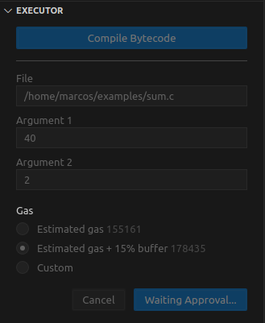

# **ChainsAtlas GO VSCode v0.5.0-beta**

Bring your favorite programming languages to any blockchain.

## Beta version disclaimer

By using the beta version of ChainsAtlas GO, you acknowledge and understand the potential risks and the unfinished state of the product.

While we strive to offer a seamless experience, unexpected issues might occur. We highly recommend not using the beta version for critical tasks and always maintaining backups of your data.

## **Table of Contents**

- [Usage](#usage)
  - [1. Login](#1-login)
  - [2. Connecting crypto wallet](#2-connecting-crypto-wallet)
  - [3. Deploying a Virtualization Unit](#3-deploying-a-virtualization-unit)
  - [4. Compiling web2 code](#4-compiling-web2-code)
  - [5. Executing web2 code](#5-executing-web2-code)
- [Troubleshooting](#troubleshooting)
- [Contributing](#contributing)

## Usage

### 1. Login

You should have received your credentials in your email if you subscribed to the ChainsAtlas GO Early Access list.

If you are not subscribed, [subscribe here](https://chainsatlas.com).

If you are subscribed but did not receive your credentials yet, please wait. We are releasing the early access in batches.

Once you have your credentials at hand, use them to login.


### 2. Connecting crypto wallet

ChainsAtlas GO uses [WalletConnect](https://walletconnect.com/) to sign transactions and [supports more than 300 crypto wallets](https://walletconnect.com/explorer?type=wallet).

#### 2.1 Scanning QRCode to connect wallet

Once you are logged in, a QR code will be displayed. Scan it using one of the supported mobile wallets to connect your wallet.

You can switch chains by selecting an option in the Chain dropdown. Once a new chain is selected, the QR code will be updated to reflect the selected chain info. You can always [edit the current chain or decide to add a new one](#2.2-editing-chain-settings) instead by clicking on the "Edit" or "Add" buttons on the right side of the chain dropdown.


When you scan the QR code with your mobile wallet, you will be prompted for a confirmation of the wallet connection. Below is an example of a [Metamask](https://metamask.io/) prompt.


After confirming the connection, you will be able to see your wallet accounts and balance in wei.


#### 2.2 Editing chain settings

To edit or add a new chain with custom settings, click the "Edit" or "Add" button next to the chain options dropdown to open the chain settings form.


You need to fill the following data:

- **Name**: only when adding a new chain configuration
- **Namespace**: chain namespace for proper id mapping (disabled when editing existing chain)
- **ID**: chain ID accordingly to the aforementioned namespace (disabled when editing existing chain)
- **Block Explorer URL**: Used to generate the transaction URLs.
- **HTTP RPC URL**: Make sure to use a stable RPC. Unstable RPC might cause errors that affect your experience with the plugin.

After saving your chain data, the chain will show up as the current selected chain in the chain dropdown and its QRCode will be displayed for scanning.

### 3. Deploying a Virtualization Unit

After connecting your wallet, you are enabled to deploy a ChainsAtlas Virtualzation Unit.

Virtualization Units are smart contracts with an integrated virtual machine capable of executing web2 code on any blockchain.


Click on the deploy button to initiate the deployment process.


You will be prompted to choose a gas option. You can choose one of the estimated ones, or enter your custom gas amount. **Remember that the gas amount is measured in wei**.

After choosing an option, click "Send" and confirm the Virtualizatioon Unit deployment through your mobile crypto wallet.


Once confirmed, your newly deployed Virtualization Unit will be selected by default.


### 4. Compiling web2 code

Now, you will need to compile your web2 code to a specific bytecode structure to send it as input to the Virtualization Unit to execute it.

> **Important**: ChainsAtlas GO is in beta. We are continuously supporting more language features and blockchains to improve user experience. Please [check our documentation](https://docs.chainsatlas.com/) to see currently available language features. Using unsupported language features will cause the compiling process to fail.

Click on the "Compile" button to get started.


If you have an active file in your editor that is from one of the Virtualization Unit supported programming languages, it will be selected by default. If that is not the case or, if you want to change the file to be compiled, click on the "Upload" button to choose a file from your system.

After selecting a file, you need to input the number of arguments required for your file code execution. You will be setting each argument value in the next step.

In our example, we're using a simple C sum function as follows:

```c
long sum(long x, long y) {
    return x + y;
}

long main() {
    long x, y, z;
    x = __chainsatlas_evm_sload(1);
    y = __chainsatlas_evm_sload(2);
    z = sum(x, y);
    __chainsatlas_evm_sstore(z)
    return z;
}
```

The `__chainsatlas_evm_sload` function loads the argument values passed to the virtualization unit in order to execute the code. The `__chainsatlas_evm_sstore` on the other hand, stores the result on-chain. For further details, check our [documentation](https://docs.chainsatlas.com/).

Click on "Compile" to send your file content and number of arguments (in this case, 2 for the sum function) to the ChainsAtlas API to compile them to a Virtualization Unit supported bytecode structure.


### 5. Executing web2 code

If you have done all the previous steps correctly, you will see a new form with your uploaded file path and text inputs for your arguments values. Fill them and click on "Estimate Gas" to move forward.


You will be prompted to choose a gas option. You can choose one of the estimated ones, or enter your custom gas amount. **Remember that the gas amount is measured in wei**.

After choosing an option, click "Execute" and confirm the smart contract interaction through your mobile crypto wallet.





Once your transaction is confirmed, the transaction hash and output will be displayed in the Transaction History View. Clicking on the transaction hash value will forward you the selected chain block explorer to visualize the transaction details.


## Troubleshooting

If you encounter issues:

- Check the error message for guidance.
- Ensure login credentials are correct.
- Ensure you are using a stable RPC.
- Try disconnecting your wallet and connecting again (could be a problem on your wallet).
- Make sure you are not using a language feature that has not been added yet. [See our docs on available language features](https://docs.chainsatlas.com/).
- Contact us at info@chainsatlas.com

## Contributing

We welcome contributions! If you have suggestions, bug reports, or feature requests, please open an issue on our GitHub repository.

---
